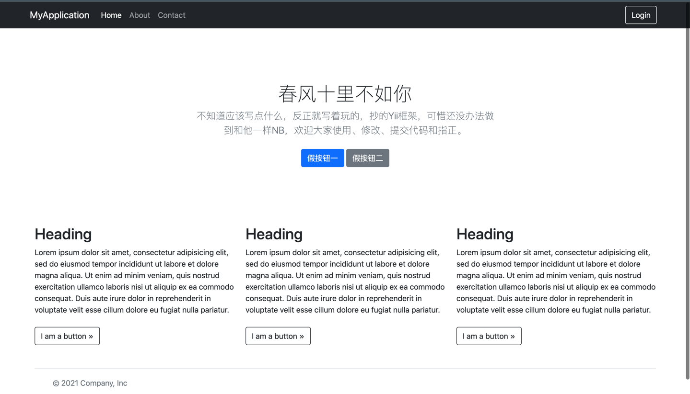
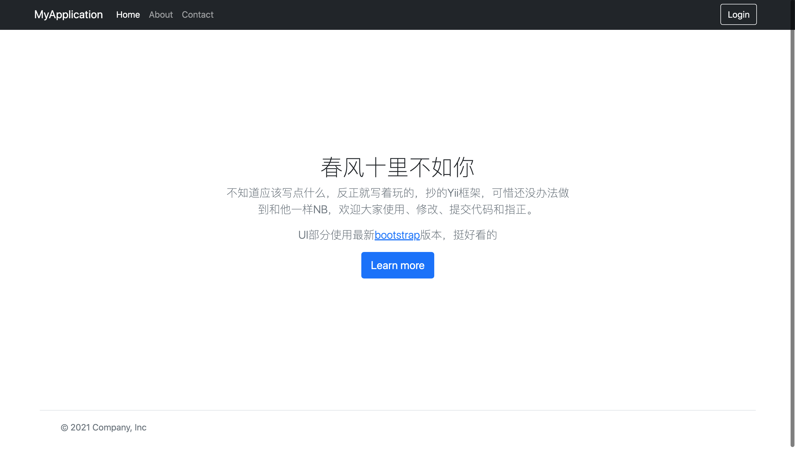
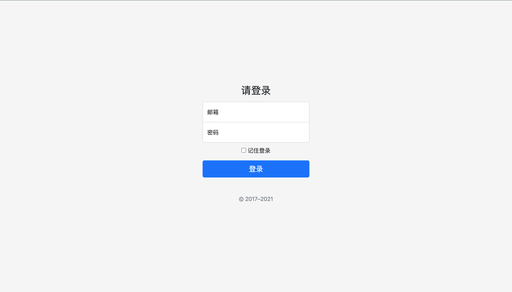
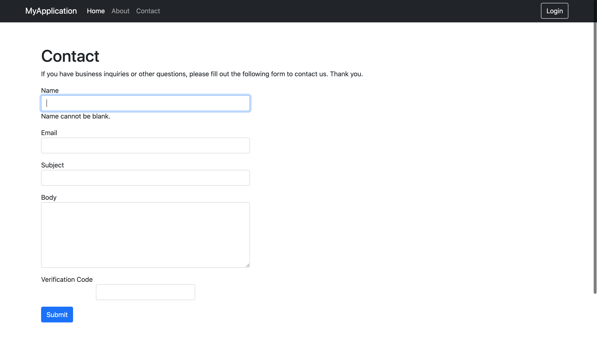

# ginYii  
这是一个PHP菜鸡通过gin框架自己封装的mvc多项目玩具框架，编写灵感来源与PHP的yii框架，不过应该还是表面上的结构类似，能力有限，也还在不断学习，项目名称暂时这么叫吧，后面要是有好的名字会启用更好听的名字。

项目正在进行中，还没有完成，没有经过正式项目检验。  
# UI截图  
(放两张图骗骗人)  

# 目标  
本项目的目标是实现一个和Yii框架一样NB好用的框架，目前还是一个菜鸡自己写着玩的玩具框架，欢迎指正，和提交代码
